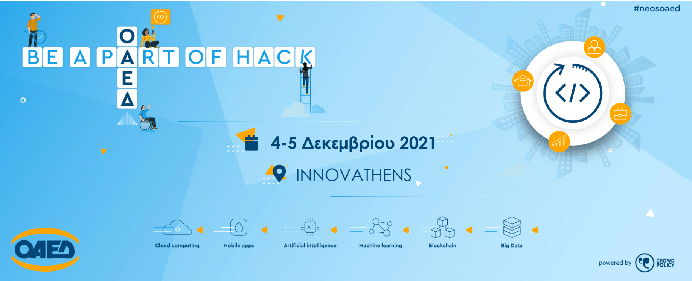

# DataMinds

# Be-a-Part-of-Hack-OAED-Crowdhackathon

## About Competitio

Be a part of hack OAED crowdhackathon, is an open innovation technological action and aims to activate (community activation) the innovation ecosystem, organizations and companies to create original applications that promote the digital transformation of OAED through new and innovative social and innovative ideas with social impact.

## Idea 

Η DataMinds είναι μια κοινότητα για νέους που επιθυμούν να κάνουν τα πρώτα τους βήματα στον τομέα των Δεδομένων (Data Science) και αναζητούν υποστήριξη και καθοδήγηση σε αυτή την διαδικασία.

H DataMinds φιλοδοξεί να γίνει η μεγαλυτερη κοινότητα στην Ελλάδα, προσανατολισμένη στις τεχνολογίες της 4ης Βιομηχανικής Επανάστασης  (Data Science, Machine/Deep Learning, Artificial Intelligence). 
Μέσα από trainings, workshops, meetups αλλά και προσωποποιημένη καθοδήγηση, παρέχει τα απαραίτητα εφόδια σε νέους επαγγελματίες που αναζητούν να εργαστούν στους παραπάνω τομείς. 
Το οργανωμένο δίκτυο έμπειρων επαγγελματιών, της DataMinds καταφέρνει να ενώσει νέους αποφοίτους με την συγκεκριμένη αγορά εργασίας και να τους υποστήριξει σε όλη την διαδικασία από την αρχική εκπαίδευση μέχρι την πρόσληψη.

Ταχέως αναπτυσσόμενη αγορά που σχετίζεται με την Ανάλυση των Δεδομένων (Πολλές διαφορετικές θέσεις: Data Analyst, Data Scientist, Machine Learning engineer). Επικεντρωνόμαστε σε συγκεκριμένη αγορά (niche)
Δεν υπάρχει BSc γι αυτές τις θέσεις, μόνο καποια λιγα Masters (Εργαζόμενοι από Πληροφορική, Μαθηματικό, Στατιστική, Οικονομικό, Business)
Δεν μπορούν να καλύψουν την ζήτηση.

Products and Services
Community and Network
Courses, Events, Meetups
Career Consulting (CV, Αιτήσεις, Job referrals)

Data Science Courses and Bootcamps [on-site]
Data Analytics
Programming
Machine Learning, Deep Learning
Databases
Cloud

(1-to-1) Consulting Sessions & Career Coaching: Personalized Consulting to kick start your career.
Linkedin, CV, Cover letter,
Studies, Courses
Github, Data Science portfolio (Github, personal website, etc)
Μελέτη αγγελιών εργασίας για τα διάφορα positions 

“Lazaros Pashalidis: Your Data Science mentor”

Community Building (Giving back to the community)
DataMinds Meetup, να εμπλακούμε στα Meetup της Θεσσαλονίκης [Data Analytics, Machine Learning meetup]
Newsletter
Free Events [workshops, career events]

On-Demand courses (Video Courses, Github repositories,)

B2B consulting
Build your data team, infrastructure, etc.
Corporate training
Business Transformation 

## Team Data Minds - Members

* Panagiotis Papaemmanouil [ LinkedIn](https://www.linkedin.com/in/panagiotis-papaemmanouil/)
* Lazaros Paschalidis [ LinkedIn](https://www.linkedin.com/in/lazaros-paschalidis-6a5074118/)
* Panogeorgios Georgios [ LinkedIn](https://www.linkedin.com/in/georgios-panogeorgos-7b3901223/)

## 🛠️ Tools Used

### 🧰 Frameworks, libraries and DB

    
    
    
    
    
    
    
    

### 💻 Software and tools

   
   
   
    
    
    
    
    
    
   

